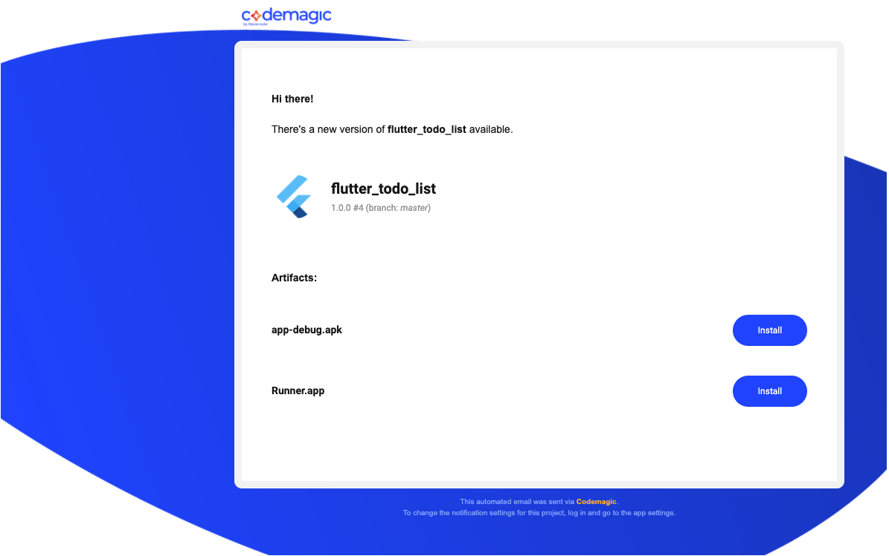

## flutter_todolist
A Flutter To-Do list app project.

## Getting Started
- git clone 'https://github.com/cybriz/flutter_todo_list.git' flutter_todo_list
- flutter create --androidx .If android or ios folders aren't present.
- flutter packages get or flutter pub get
- flutter run

## Concepts
- Kiwi for inversion of control(ioC) pattern in flutter.
- Lint for code to ensure high code quality and reduce the likelihood that changes inadvertently break something. 
- Provider for simple state management.
- Stream builder for reactive data.
- SQLite for persistence.
- Uses Moor as an abstraction layer on top of SQFlite to perform write queries and update streams in this project.

## Install demo app into your own phone
APK(android): https://drive.google.com/file/d/1PHcM9Rn3OPA66A2Cg7ddfsh5ezVGxuiS/view?usp=sharing

RUNNER(ios): https://drive.google.com/file/d/1XdmIAyK42pZYTpdapjt6l7M7Zohcj95y/view?usp=sharing

- Download the apk using phone default Package Installer.
- Tap the 'apk' file for android and 'runner' file for ios.
- Click 'install' and then 'install anyway'.
- Click 'Done' or 'Open' to proceed.

## Run Test
- [Unit Test] Go to the project directory, under 'test/validator_unit_test.dart and click 'Run' above each function 
   to run the unit test.

- [Integration Test] Please copy paste the command below in the terminal in order to run the integration test.
- flutter drive --target=test_driver/app.dart

## Screenshots
- CICD image

